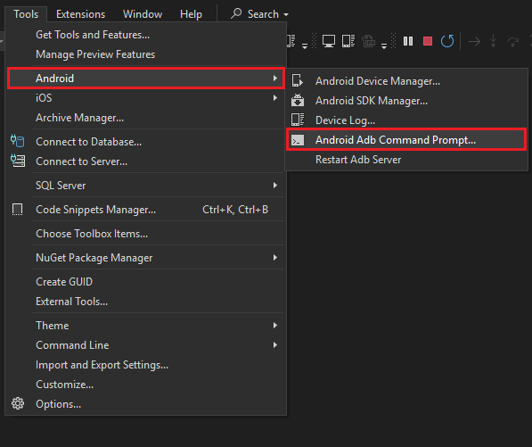

# AbpSolution1

## About this solution

This is a layered startup solution based on [Domain Driven Design (DDD)](https://abp.io/docs/latest/framework/architecture/domain-driven-design) practises. All the fundamental ABP modules are already installed. Check the [Application Startup Template](https://abp.io/docs/latest/solution-templates/layered-web-application) documentation for more info.

### Pre-requirements

* [.NET9.0+ SDK](https://dotnet.microsoft.com/download/dotnet)
* [Node v18 or 20](https://nodejs.org/en)
* [Redis](https://redis.io/)

### Configurations

The solution comes with a default configuration that works out of the box. However, you may consider to change the following configuration before running your solution:

* Check the `ConnectionStrings` in `appsettings.json` files under the `AbpSolution1.AuthServer`, `AbpSolution1.HttpApi.Host` and `AbpSolution1.DbMigrator` projects and change it if you need.
* Check the `ConnectionStrings` in `appsettings.json` files under the `AbpSolution1.Web.Public` as well.

### Before running the application

* Run `abp install-libs` command on your solution folder to install client-side package dependencies. This step is automatically done when you create a new solution, if you didn't especially disabled it. However, you should run it yourself if you have first cloned this solution from your source control, or added a new client-side package dependency to your solution.
* Run `AbpSolution1.DbMigrator` to create the initial database. This step is also automatically done when you create a new solution, if you didn't especially disabled it. This should be done in the first run. It is also needed if a new database migration is added to the solution later.

#### Generating a Signing Certificate

In the production environment, you need to use a production signing certificate. ABP Framework sets up signing and encryption certificates in your application and expects an `openiddict.pfx` file in your application.

To generate a signing certificate, you can use the following command:

```bash
dotnet dev-certs https -v -ep openiddict.pfx -p 3d3061b3-6d69-4332-9e92-7c93e1030b9a
```

> `3d3061b3-6d69-4332-9e92-7c93e1030b9a` is the password of the certificate, you can change it to any password you want.

It is recommended to use **two** RSA certificates, distinct from the certificate(s) used for HTTPS: one for encryption, one for signing.

For more information, please refer to: [OpenIddict Certificate Configuration](https://documentation.openiddict.com/configuration/encryption-and-signing-credentials.html#registering-a-certificate-recommended-for-production-ready-scenarios)

> Also, see the [Configuring OpenIddict](https://abp.io/docs/latest/Deployment/Configuring-OpenIddict#production-environment) documentation for more information.

### Solution structure

This is a layered monolith application that consists of the following applications:

* `AbpSolution1.DbMigrator`: A console application which applies the migrations and also seeds the initial data. It is useful on development as well as on production environment.
* `AbpSolution1.AuthServer`: ASP.NET Core MVC / Razor Pages application that is integrated OAuth 2.0(`OpenIddict`) and account modules. It is used to authenticate users and issue tokens.
* `AbpSolution1.HttpApi.Host`: ASP.NET Core API application that is used to expose the APIs to the clients.
* `AbpSolution1.Web.Public`: ASP.NET Core MVC / Razor Pages application that is the public web application of the solution.
* `angular`: Angular application.

### Running the MAUI Mobile Application

To run the MAUI mobile application, you should first run the host application in order to MAUI application communicate with the backend services.
Then, you should be able to run the MAUI mobile application. There is only a few steps that you need to do, if you want to run the application in an android emulator, as described in the following section.

> For further information, please refer to [Getting Started with the MAUI](https://abp.io/docs/latest/framework/ui/maui?Tiered=No) documentation.

#### Android

To run your MAUI application on an Android device and enable communication with backend services, you need to set up port mapping using the `adb` tool. This allows your mobile app to access backend APIs running on your development machine.

**How to get and use `adb` tool:**

- **Option 1: Install `adb` globally**  
  Download and install the [Android SDK Platform-Tools](https://developer.android.com/tools/releases/platform-tools) to get the [`adb`](https://developer.android.com/tools/adb) command-line tool.
- **Option 2: Use Visual Studio’s built-in `adb` command prompt**  
  If you are using Visual Studio, you can access the `adb` command prompt directly from the IDE:  
  

> For more information on setting up your environment for Android development and debugging, refer to the [Microsoft MAUI Android device setup guide](https://learn.microsoft.com/en-us/dotnet/maui/android/device/setup).

**Port mapping command:**

Once `adb` is available, run the following command in your terminal (or Visual Studio's `adb` command prompt) to map the backend port to your Android device:

```bash
adb reverse tcp:44304 tcp:44304
```

## Deploying the application

Deploying an ABP application follows the same process as deploying any .NET or ASP.NET Core application. However, there are important considerations to keep in mind. For detailed guidance, refer to ABP's [deployment documentation](https://abp.io/docs/latest/Deployment/Index).

### Additional resources


#### Internal Resources

You can find detailed setup and configuration guide(s) for your solution below:

* [Docker-Compose](./etc/docker-compose/README.md)
* [Docker-Compose for Infrastructure Dependencies](./etc/docker/README.md)
* [Local Kubernetes Guide](./etc/helm/README.md)
* [Angular](./angular/README.md)

#### External Resources
You can see the following resources to learn more about your solution and the ABP Framework:

* [Web Application Development Tutorial](https://abp.io/docs/latest/tutorials/book-store/part-1)
* [Application Startup Template](https://abp.io/docs/latest/startup-templates/application/index)
* [LeptonX Theme Module](https://abp.io/docs/latest/themes/lepton-x/index)
* [LeptonX Angular UI](https://abp.io/docs/latest/themes/lepton-x/angular)
